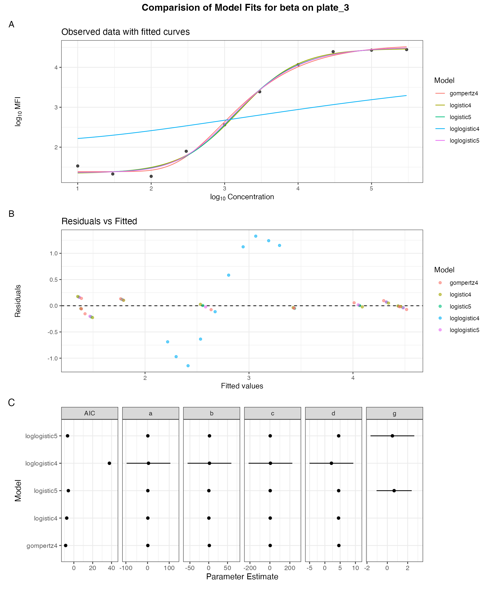

# Frequentist Modeling of Immunoassay Standard Curves with the StandardCurve Class: Bead Array Example

## Overview

This vignette demonstrates a complete workflow for fitting standard
curves for immunoassay data, including bead array assay data, and
deriving detection metrics using the `curveRfreq` package. The workflow
is encapsulated in the `StandardCurve` R6 class, which wraps the full
`curveRfreq` pipeline into a single stateful object with a clean,
verb-driven API: the class handles everything from antigen selection
through model fitting, QC metrics, error propagation, and plotting.

We walk through the complete workflow:

1.  **Load and prepare data** — load the built-in `bead_assay_example`
    dataset and construct the `StandardCurve` object with study settings
    and antigen constraints.
2.  **Set Curve Settings** (`$set_curve_settings()`) — Resolves
    antigen-specific curve settings for the data loaded into the
    StandardCurve object, including lower asymptote handling (fix,
    constrained, etc.) and blank variability estimates.
3.  **Fit** (`$fit()`) — fit candidate nonlinear models with the
    constants set in the object and select the best model grounded in
    information theory.
4.  **Compare** (`$compare_models()`) — Provides a visual comparison of
    the converging models fit including an overlay, residuals vs. fitted
    values, the parameter estimates, and the AIC.
5.  **Summarize** (`$summarize()`) — inspect fitted parameters and key
    QC metrics for the standard curve:
    - Inflection Point
    - Limits of Detection (LOD)
    - Minimum/Maximum Detectable Concentrations (MDC)
    - Reliable Detection Limits (RDL)
    - Curvature-based Limits of Quantification (LOQ)
6.  **Plot** (`$plot()`) — visualize the final standard curve
7.  **Propagate error** (`$propagate_error()`) — compute sample
    concentration predictions, measurement error, and the Precision
    Profile
8.  **Extract** (`$get_results()`) — pull tables for downstream use

## Setup

We begin by loading the development version of the package.

``` r
devtools::load_all()
```

## Load Example Data

The package ships with `bead_assay_example`, a synthetic multi-plate
bead-based immunoassay dataset containing standard curves, blanks, and
patient samples across two antigens (`alpha` and `beta`) each run on
three plates.

``` r
data(bead_assay_example)

# Inspect the curve/plate lookup table
head(bead_assay_example$curve_id_lookup)
#>   curve_id antigen study_accession experiment_accession   plate
#> 1        1   alpha      SDYexample           EXPexample plate_1
#> 2        2   alpha      SDYexample           EXPexample plate_2
#> 3        3   alpha      SDYexample           EXPexample plate_3
#> 4        4    beta      SDYexample           EXPexample plate_1
#> 5        5    beta      SDYexample           EXPexample plate_2
#> 6        6    beta      SDYexample           EXPexample plate_3
```

The structure of `bead_assay_example`:

A named list of simulated multi-plate bead-based immunoassay data
spanning 6 plates across 2 analytes (`alpha` and `beta`), each measured
on 3 replicate plates. It contains 20 patient samples per plate across 3
timepoints (baseline, month3, month6) and 2 treatment groups. The
response variable is median fluorescence intensity (`mfi`) rather than
optical density or absorbance. The `assay_response_variable` is a string
corresponding to the name of the assay response column (mfi for
bead-based assays). More information can be found by running
[`help(bead_assay_example)`](https://immunoplex.github.io/curveRfreq/reference/bead_assay_example.md).

The `StandardCurve` class expects the `bead_assay_example` list to
contain `$standards`, `$blanks`, `$samples`, `$response_var`, and
`$indep_var`.

``` r
str(bead_assay_example, max.level = 2, give.attr = FALSE, vec.len = 2)
#> List of 6
#>  $ standards      :'data.frame': 60 obs. of  8 variables:
#>   ..$ curve_id                  : int [1:60] 1 1 1 1 1 ...
#>   ..$ stype                     : chr [1:60] "S" "S" ...
#>   ..$ sampleid                  : chr [1:60] "STD_01" "STD_02" ...
#>   ..$ well                      : chr [1:60] "A1" "B1" ...
#>   ..$ dilution                  : num [1:60] 1000 333 ...
#>   ..$ mfi                       : num [1:60] 109 317 ...
#>   ..$ assay_response_variable   : chr [1:60] "mfi" "mfi" ...
#>   ..$ assay_independent_variable: chr [1:60] "concentration" "concentration" ...
#>  $ blanks         :'data.frame': 24 obs. of  7 variables:
#>   ..$ curve_id                  : int [1:24] 1 1 1 1 2 ...
#>   ..$ stype                     : chr [1:24] "B" "B" ...
#>   ..$ well                      : chr [1:24] "G11" "H11" ...
#>   ..$ dilution                  : int [1:24] 1 1 1 1 1 ...
#>   ..$ mfi                       : num [1:24] 18.6 17.3 18.7 14.6 15.7 ...
#>   ..$ assay_response_variable   : chr [1:24] "mfi" "mfi" ...
#>   ..$ assay_independent_variable: chr [1:24] "concentration" "concentration" ...
#>  $ samples        :'data.frame': 120 obs. of  13 variables:
#>   ..$ curve_id                  : int [1:120] 1 1 1 1 1 ...
#>   ..$ timeperiod                : chr [1:120] "baseline" "baseline" ...
#>   ..$ patientid                 : chr [1:120] "PAT_001" "PAT_002" ...
#>   ..$ well                      : chr [1:120] "A3" "B3" ...
#>   ..$ stype                     : chr [1:120] "X" "X" ...
#>   ..$ sampleid                  : chr [1:120] "a001" "a002" ...
#>   ..$ agroup                    : chr [1:120] "GroupA" "GroupB" ...
#>   ..$ dilution                  : int [1:120] 2000 2000 2000 2000 2000 ...
#>   ..$ pctaggbeads               : num [1:120] 2.49 1.92 3.44 3.7 1.15 ...
#>   ..$ samplingerrors            : num [1:120] NA NA NA NA NA ...
#>   ..$ mfi                       : num [1:120] 18323 19415 ...
#>   ..$ assay_response_variable   : chr [1:120] "mfi" "mfi" ...
#>   ..$ assay_independent_variable: chr [1:120] "concentration" "concentration" ...
#>  $ curve_id_lookup:'data.frame': 6 obs. of  5 variables:
#>   ..$ curve_id            : int [1:6] 1 2 3 4 5 ...
#>   ..$ antigen             : chr [1:6] "alpha" "alpha" ...
#>   ..$ study_accession     : chr [1:6] "SDYexample" "SDYexample" ...
#>   ..$ experiment_accession: chr [1:6] "EXPexample" "EXPexample" ...
#>   ..$ plate               : chr [1:6] "plate_1" "plate_2" ...
#>  $ response_var   : chr "mfi"
#>  $ indep_var      : chr "concentration"
```

We choose a `curve_id` from the lookup table and use a custom filtering
function (`filter_by_curve_id)` to subset the dataset of interest
(`bead_assay_example` in this vignette). This function takes the full
dataset and the chosen `curve_id`, filters all relevant components, and
returns a reduced dataset containing only records associated with that
specific curve. The filtered dataset is then passed to the constructor.

``` r
filter_by_curve_id <- function(loaded_data,
                               curve_id,
                               target_names = c("standards", "blanks",
                                                "samples", "curve_id_lookup"),
                               verbose = FALSE) {
  
  filtered <- loaded_data
  
  filtered$curve_id_whole_lookup <- filtered$curve_id_lookup
  filtered$whole_standards <- filtered$standards
  filtered[target_names] <- lapply(filtered[target_names], function(df) {
    
    # Skip non-data frames
    if (!is.data.frame(df)) {
      if (verbose) message("[filter_by_curve_id] Skipping non-data.frame")
      return(df)
    }
    
    # Skip empty data
    if (nrow(df) == 0) {
      if (verbose) message("[filter_by_curve_id] Empty data.frame")
      return(df)
    }
    
    # Skip if no curve_id column
    if (!"curve_id" %in% names(df)) {
      if (verbose) message("[filter_by_curve_id] No curve_id column")
      return(df)
    }
    
    # Filter
    df[as.character(df$curve_id) == as.character(curve_id), , drop = FALSE]
  })
  
  return(filtered)
}
```

``` r
curve_id   <- 6
antigen <- bead_assay_example$curve_id_lookup[bead_assay_example$curve_id_lookup$curve_id == curve_id,]$antigen
curve_data <- filter_by_curve_id(bead_assay_example, curve_id = curve_id)
```

## Configuration

- `model_names`: Candidate nonlinear models considered during the
  fitting algorithm. Model names are specified as a vector of strings
  limited to:
  - logistic5
  - loglogistic5
  - logistic4
  - loglogistic4
  - gompertz4

**To manually exclude a model form from consideration do not include it
in the list.**

- `is_display_log_response` and `is_display_log_independent` flags
  control whether plotting results are displayed on log scales or not.

``` r
model_names <- c("logistic5", "loglogistic5",
                 "logistic4", "loglogistic4",
                 "gompertz4")

is_display_log_response    <- TRUE
is_display_log_independent <- TRUE
verbose                    <- TRUE
```

## Define Antigen Constraints and Study Parameters

These are specified once and passed to `$new()`. They apply to every
`$set_curve_settings()` / `$fit()` call on this object.

### Antigen Constraints

For the particular antigen in a study and experiment, constraints on the
lower asymptote of the standard curve and constraint method as well as
the standard curve concentration is set. The lower asymptote
`l_asy_constraint_method` can be set to the following:

- `default`: the default constraints built into the algorithm
- `user_defined`: uses `l_asy_min_constraint` and `l_asy_max_constraint`
  to constrain the lower asymptote. This is helpful if one wishes to fix
  the lower asymptote to a constant such as an MFI value of 0.
- `range_of_blanks`: uses the range of the blanks for the associated
  antigen and plate identifier as the lower asymptote.
- `geometric_mean_of_blanks`: constrains the lower asymptote for the
  associated antigen and plate identifier to the geometric mean of the
  blanks.

``` r
antigen_constraints <- data.frame(
  antigen                      = antigen,
  l_asy_min_constraint         = 0,
  l_asy_max_constraint         = 0,
  l_asy_constraint_method      = "default",
  standard_curve_concentration = 10000,
  pcov_threshold               = 15,
  stringsAsFactors             = FALSE
)

print(antigen_constraints)
#>   antigen l_asy_min_constraint l_asy_max_constraint l_asy_constraint_method
#> 1    beta                    0                    0                 default
#>   standard_curve_concentration pcov_threshold
#> 1                        10000             15
```

### Study Parameters

Parameters for the entire study are set in a named list before fitting
the standard curve and influence its fit. The following are the
parameters and their accepted values and definitions. The example below
uses the suggested defaults.

- **`applyProzone`**  
  Logical (`TRUE` or `FALSE`).  
  Determines whether prozone (hook effect) detection and correction is
  applied.

  - `TRUE`: Detects and adjusts for potential signal suppression at low
    dilutions.  
  - `FALSE`: No prozone correction is performed.

- **`blank_option`**  
  Character string. Controls how blank wells are handled. Options
  include:

  - `"ignored"`: Blank wells are excluded from analysis.  
  - `"subtracted"`: The geometric mean of blank responses is subtracted
    from observed responses.
  - `"subtracted_3x"`: 3 times the geometric mean of blank responses is
    subtracted from observed responses.
  - `"subtracted_10x"`: 10 times the geometric mean of blank responses
    is subtracted from observed responses.

  MFI values from test samples below zero are not possible (fluorescence
  intensity is physically constrained to non-negative values) and are
  set to zero.

- **`is_log_response`**  
  Logical (`TRUE` or `FALSE`).  
  Indicates whether the response variable (e.g., MFI or absorbance)
  should be log-transformed.

  - `TRUE`: Fit models on the log-transformed response.  
  - `FALSE`: Use the raw response values.

- **`is_log_independent`**  
  Logical (`TRUE` or `FALSE`).  
  Specifies whether the independent variable (concentration) is
  log-transformed.

  - `TRUE`: Use log-scale for the independent variable.  
  - `FALSE`: Use the original scale.

``` r
study_params <- list(
  applyProzone       = TRUE,
  blank_option       = "ignored",
  is_log_response    = TRUE,
  is_log_independent = TRUE
)
```

## Construct the StandardCurve Object

Pass the filtered data, study parameters, and constraints to `$new()`.
The class reads `response_var` and `indep_var` directly from
`curve_data`.

``` r
sc <- StandardCurve$new(
  loaded_data                = curve_data,
  study_params               = study_params,
  antigen_constraints        = antigen_constraints,
  model_names                = model_names,
  is_display_log_response    = is_display_log_response,
  is_display_log_independent = is_display_log_independent,
  verbose                    = verbose
)
#> [StandardCurve] Initialized.
#>   response variable   : mfi
#>   independent variable: concentration

# Printing the object shows pipeline status at any time
sc
#> 
#> <StandardCurve>
#>   Stage    : NA
#> 
#>   Steps:
#>     [ ] set_curve_settings()
#>     [ ] fit()
#>     [ ] propagate_error()
```

## Set Curve Settings

`$set_curve_settings()` receives the data in the `StandardCurve` object
containing a single antigen / plate combination and resolves
antigen-specific constraints. It resets any stale fit results
automatically so re-selecting is always safe.

``` r
sc$set_curve_settings()
#> 
#> -------------------------------------------------------
#>                   SET CURVE SETTINGS
#> -------------------------------------------------------
#> [resolve_curve_settings] counts: standard=10, blanks=4, samples=20
```

The filtered standards and antigen settings are now available for
inspection if desired.

``` r
head(sc$antigen_plate$plate_standard)
#>    curve_id stype sampleid well    dilution    mfi assay_response_variable
#> 51        6     S   STD_01   A1 1000.000000   33.8                     mfi
#> 52        6     S   STD_02   B1  333.333333   21.3                     mfi
#> 53        6     S   STD_03   C1  100.000000   18.6                     mfi
#> 54        6     S   STD_04   D1   33.333333   79.0                     mfi
#> 55        6     S   STD_05   E1   10.000000  363.3                     mfi
#> 56        6     S   STD_06   F1    3.333333 2442.8                     mfi
#>    assay_independent_variable
#> 51              concentration
#> 52              concentration
#> 53              concentration
#> 54              concentration
#> 55              concentration
#> 56              concentration
sc$antigen_plate$antigen_settings
#> $study_accession
#> [1] "SDYexample"
#> 
#> $experiment_accession
#> [1] "EXPexample"
#> 
#> $plate
#> [1] "plate_3"
#> 
#> $antigen
#> [1] "beta"
#> 
#> $l_asy_min_constraint
#> [1] 0
#> 
#> $l_asy_max_constraint
#> [1] 27825.2
#> 
#> $l_asy_constraint_method
#> [1] "default"
#> 
#> $std_error_blank
#> [1] 1.309819
#> 
#> $standard_curve_concentration
#> [1] 10000
#> 
#> $pcov_threshold
#> [1] 15
```

## Model Fitting and Selection

`$fit()` runs the entire fitting pipeline in one call across eight
internal stages: preprocessing, formula construction, constraint
computation, starting value generation, multi-start nonlinear least
squares, model comparison, AIC-based selection, and QC metric
calculation.

``` r
sc$fit()
#> 
#> -------------------------------------------------------
#>                       FIT MODELS
#> -------------------------------------------------------
#> [1/8] Preprocessing data ...
#> Applying prozone correction
#> Peak MFI = 27825.2 at concentration = 5.477121 
#> Number of points beyond the peak: 0
#> Blank Option Used: ignored
#> [2/8] Building model formulas ...
#> [3/8] Computing parameter constraints ...
#> [obtain_model_constraints] scale_class=high, dynamic_range=3.175, slope=[0.100, 2.000], g=[0.50, 5.00]
#> $logistic5
#> $logistic5$lower
#>         a         b         c         d         g 
#> -5.000000  0.100000  1.000000  1.269523  0.500000 
#> 
#> $logistic5$upper
#>        a        b        c        d        g 
#> 4.444438 2.000000 5.477121 6.031901 5.000000 
#> 
#> 
#> $loglogistic5
#> $loglogistic5$lower
#>         a         b         c         d         g 
#> -4.698970  0.100000  1.000000  1.269523  0.500000 
#> 
#> $loglogistic5$upper
#>        a        b        c        d        g 
#> 4.444438 2.000000 5.477121 6.031901 5.000000 
#> 
#> 
#> $logistic4
#> $logistic4$lower
#>         a         b         c         d 
#> -4.698970  0.100000  1.000000  1.269523 
#> 
#> $logistic4$upper
#>        a        b        c        d 
#> 4.444438 2.000000 5.477121 6.031901 
#> 
#> 
#> $loglogistic4
#> $loglogistic4$lower
#>         a         b         c         d 
#> -4.698970  0.100000  1.000000  1.269523 
#> 
#> $loglogistic4$upper
#>        a        b        c        d 
#> 4.444438 2.000000 5.477121 6.031901 
#> 
#> 
#> $gompertz4
#> $gompertz4$lower
#>         a         b         c         d 
#> -4.698970  0.100000  1.000000  1.269523 
#> 
#> $gompertz4$upper
#>        a        b        c        d 
#> 4.444438 2.000000 5.477121 6.031901 
#> 
#> 
#> attr(,"constraint_profile")
#> attr(,"constraint_profile")$y_min
#> [1] 1.269513
#> 
#> attr(,"constraint_profile")$y_max
#> [1] 4.444438
#> 
#> attr(,"constraint_profile")$dynamic_range
#> [1] 3.174925
#> 
#> attr(,"constraint_profile")$conc_range
#> [1] 4.477121
#> 
#> attr(,"constraint_profile")$scale_class
#> [1] "high"
#> 
#> attr(,"constraint_profile")$slope_max
#> [1] 2
#> 
#> attr(,"constraint_profile")$slope_min
#> [1] 0.1
#> 
#> attr(,"constraint_profile")$g_min
#> [1] 0.5
#> 
#> attr(,"constraint_profile")$g_max
#> [1] 5
#> 
#> attr(,"constraint_profile")$conc_pad_frac
#> [1] 0.5
#> 
#> attr(,"constraint_profile")$d_margin_frac
#> [1] 0.5
#> [4/8] Generating start lists ...
#> [5/8] Fitting candidate models ...
#> 
#>  Trying model: logistic5
#>   ✓ logistic5 converged (AIC=-5.83)
#> 
#>  Trying model: loglogistic5
#>   ✓ loglogistic5 converged (AIC=-6.68)
#> 
#>  Trying model: logistic4
#>   ✓ logistic4 converged (AIC=-7.56)
#> 
#>  Trying model: loglogistic4
#>   ✓ loglogistic4 converged (AIC=37.73)
#> 
#>  Trying model: gompertz4
#>   ✓ gompertz4 converged (AIC=-8.7)
#> [6/8] Summarising model fits ...
#> [7/8] Extracting parameter estimates ...
#> confint2 output:[1] "logistic5"
#>         2.5 %    97.5 %
#> a  1.06437224 1.6478438
#> b -0.04612528 0.7543286
#> c  1.75202838 4.2177088
#> d  4.10957370 4.9079735
#> g -1.05827593 2.3978498
#> 
#> 
#> confint2 output:[1] "loglogistic5"
#>        2.5 %   97.5 %
#> a  1.0778087 1.654048
#> b  0.1406949 3.859305
#> c  2.6135651 3.581442
#> d  4.1791972 4.841422
#> g -1.6514408 2.651441
#> 
#> 
#> confint2 output:[1] "logistic4"
#>       2.5 %    97.5 %
#> a 1.1072840 1.5695272
#> b 0.2609865 0.5516614
#> c 3.0413977 3.3517882
#> d 4.2482237 4.6928507
#> 
#> 
#> confint2 output:[1] "loglogistic4"
#>         2.5 %     97.5 %
#> a  -96.553693 105.442569
#> b  -56.214403  60.214403
#> c -213.743315 224.697557
#> d   -5.017843   9.304083
#> 
#> 
#> confint2 output:[1] "gompertz4"
#>      2.5 %   97.5 %
#> a 1.203032 1.572884
#> b 1.049807 2.091670
#> c 2.809200 3.109931
#> d 4.302785 4.850222
#> Summarized Parameters completed
#> [8/8] Building plot data & selecting best model ...
#> Plot Data Completed
#> 
#> Best model: gompertz4
#> Done. Call $summarize(), $plot(), or $propagate_error().
```

The object now holds all intermediate results as accessible fields —
nothing is hidden.

``` r
# Raw candidate fits
sc$fit_summary          # AIC, BIC, RSS for each model
#>          model converged        rss df_resid n_params       AIC       BIC
#> 1    logistic5      TRUE 0.09841287        5        5 -5.832917 -4.017407
#> 2 loglogistic5      TRUE 0.09040526        5        5 -6.681609 -4.866098
#> 3    logistic4      TRUE 0.10109273        6        4 -7.564251 -6.051325
#> 4 loglogistic4      TRUE 9.37313393        6        4 37.731395 39.244320
#> 5    gompertz4      TRUE 0.09020143        6        4 -8.704180 -7.191254
sc$fit_params           # parameter estimates and CIs per model
#>           model parameter  estimate      conf.low   conf.high converged
#> 1     logistic5         a 1.3561080    1.06437224   1.6478438      TRUE
#> 2     logistic5         b 0.3541016   -0.04612528   0.7543286      TRUE
#> 3     logistic5         c 2.9848686    1.75202838   4.2177088      TRUE
#> 4     logistic5         d 4.5087736    4.10957370   4.9079735      TRUE
#> 5     logistic5         g 0.6697869   -1.05827593   2.3978498      TRUE
#> 6  loglogistic5         a 1.3659284    1.07780874   1.6540480      TRUE
#> 7  loglogistic5         b 2.0000000    0.14069486   3.8593051      TRUE
#> 8  loglogistic5         c 3.0975036    2.61356514   3.5814421      TRUE
#> 9  loglogistic5         d 4.5103094    4.17919717   4.8414217      TRUE
#> 10 loglogistic5         g 0.5000000   -1.65144081   2.6514408      TRUE
#> 11    logistic4         a 1.3384056    1.10728400   1.5695272      TRUE
#> 12    logistic4         b 0.4063240    0.26098654   0.5516614      TRUE
#> 13    logistic4         c 3.1965929    3.04139772   3.3517882      TRUE
#> 14    logistic4         d 4.4705372    4.24822368   4.6928507      TRUE
#> 15 loglogistic4         a 4.4444383  -96.55369273 105.4425693      TRUE
#> 16 loglogistic4         b 2.0000000  -56.21440293  60.2144029      TRUE
#> 17 loglogistic4         c 5.4771213 -213.74331458 224.6975571      TRUE
#> 18 loglogistic4         d 2.1431198   -5.01784334   9.3040830      TRUE
#> 19    gompertz4         a 1.3879578    1.20303198   1.5728836      TRUE
#> 20    gompertz4         b 1.5707384    1.04980668   2.0916701      TRUE
#> 21    gompertz4         c 2.9595655    2.80919977   3.1099313      TRUE
#> 22    gompertz4         d 4.5765032    4.30278473   4.8502216      TRUE
```

## Summarize

`$summarize()` computes and prints fit statistics, curve characteristics
(inflection point, LOD, MDC, RDL, LOQ), and the tidy parameter table to
the console — including the best model name, candidate model comparison
(AIC, BIC, RSS), and QC metrics. A summary of the fitted model
parameters alongside their lower and upper constraints is stored in
`$best_fit$best_parameters` as a data frame, making it available for
reporting and downstream analysis.

``` r
sc$summarize()
#> 
#> ================================================================
#>   Standard Curve Summary
#> ================================================================
#>   Best model   : gompertz4
#>   curve_id     : 6
#>   Response var : mfi  |  Independent var: concentration
#> Finished tidy.nlsLM
#> [compute_inflection_point] Inflection point: (x = 2.959566, y = 2.560958)
#> MDC/RDL - mindc: 2.293, maxdc: 4.494, minrdl: 2.516, maxrdl: 4.19
#> ================================================================

sc$best_fit$best_model_name
#> [1] "gompertz4"
sc$best_fit$best_parameters        # parameter table
#>   curve_id term     lower    upper estimate  std_error statistic      p_value
#> 1        6    a -4.698970 4.444438 1.387958 0.07557519 18.365257 1.679637e-06
#> 2        6    b  0.100000 2.000000 1.570738 0.21289353  7.378047 3.179050e-04
#> 3        6    c  1.000000 5.477121 2.959566 0.06145124 48.161203 5.372477e-09
#> 4        6    d  1.269523 6.031901 4.576503 0.11186282 40.911746 1.426055e-08
sc$best_fit$best_fit_summary # QC metrics + fit stats (one row)
#>   curve_id iter status model_name        a        b        c        d  g
#> 1        6    6   TRUE  gompertz4 1.387958 1.570738 2.959566 4.576503 NA
#>   inflect_x inflect_y     llod     ulod    mindc    maxdc   minrdl   maxrdl
#> 1  2.959566  2.560958 1.572884 4.302785 2.293386 4.494308 2.515882 4.189783
#>       lloq    uloq   lloq_y   uloq_y dfresidual nobs rsquare_fit      aic
#> 1 2.346861 3.57245 1.620565 3.564412          6   10   0.9945901 -8.70418
#>         bic  loglik        mse       cv bkg_method is_log_response is_log_x
#> 1 -7.191254 9.35209 0.01503357 4.183725    ignored            TRUE     TRUE
#>   apply_prozone                                                 formula
#> 1          TRUE mfi ~ a + (d - a) * exp(-exp(-b * (concentration - c)))
```

Each row corresponds to a model parameter whose definitions are as
follows.

### Model Parameters

| Parameter | Description                                   |
|-----------|-----------------------------------------------|
| `a`       | Lower asymptote                               |
| `b`       | Slope parameter                               |
| `c`       | Inflection point (midpoint)                   |
| `d`       | Upper asymptote                               |
| `g`       | Asymmetry parameter (5-parameter models only) |

The columns include:

- `term`: Name of the model parameter
- `lower`, `upper`: Bounds for the parameter based on constraints
- `estimate`: Estimated value of the parameter
- `std_error`: Standard error of the estimate
- `statistic`: Test statistic (estimate divided by standard error)
- `p_value`: p-value of the parameter
- `curve_id`: Unique identifier for the fitted curve

The resulting `best_fit$best_fit_summary` contains one row per fitted
curve and includes:

**Curve Characteristics**

| Metric                                          | Notation                 | Description                                                                                                                                                                                                                                                                                                                                                                               |
|-------------------------------------------------|--------------------------|-------------------------------------------------------------------------------------------------------------------------------------------------------------------------------------------------------------------------------------------------------------------------------------------------------------------------------------------------------------------------------------------|
| Inflection Point                                | `(inflect_x, inflect_y)` | The point on the standard curve where the concavity transitions from concave up to concave down. It is the point where the assay is most sensitive to measurement errors in the measured response of the assay.                                                                                                                                                                           |
| Limits of Detection (LOD)                       | `(llod, ulod)`           | Lower and upper LODs are defined as the upper 97.5% confidence bound of the lower asymptote and the lower 2.5% confidence bound of the upper asymptote, respectively (Rajam et al.). Limits of Detection correspond to the y-coordinate in the legend, as they are defined on the response axis.                                                                                          |
| Minimum/Maximum Detectable Concentrations (MDC) | `(mindc, maxdc)`         | The smallest antibody concentration that produces a signal the assay can detect above background (Rajam et al.). This corresponds to the x-coordinate of the Lower Limit of Detection in the legend, as it is on the concentration axis.                                                                                                                                                  |
| Reliable Detection Limits (RDL)                 | `(minrdl, maxrdl)`       | Lower RDL: The lowest concentration at which the assay consistently produces a signal above background with 95% confidence based on the fit of the standard curve (Rajam et al.). Upper RDL: Analogously, the highest concentration at which the assay consistently produces a signal below the upper asymptote (saturation) with 95% confidence, based on the fit of the standard curve. |
| Limits of Quantification (LOQ)                  | `(lloq, uloq)`           | Defines a region of assay response (MFI) and concentration where sample estimates have less measurement error. Limits of Quantification are derived from the local minimum and maximum of the second derivative of x given y of the standard curve (Daly et al.), (Jeanne L Sebaugh and P. D. McCray), (Sanz et al.).                                                                     |

------------------------------------------------------------------------

**Model Fit Statistics**

| Metric                      | Notation      | Description                                                      |
|-----------------------------|---------------|------------------------------------------------------------------|
| Residual Degrees of Freedom | `dfresidual`  | Degrees of freedom remaining after model fitting                 |
| Number of Observations      | `nobs`        | Total number of data points used in the fit                      |
| R-squared                   | `rsquare_fit` | Goodness-of-fit measure                                          |
| AIC                         | `aic`         | Akaike Information Criterion for model selection                 |
| BIC                         | `bic`         | Bayesian Information Criterion for model selection               |
| Log-likelihood              | `loglik`      | Likelihood of the fitted model                                   |
| Mean Squared Error          | `mse`         | Average squared difference between observed and predicted values |
| Coefficient of Variation    | `cv`          | Relative variability of the residuals                            |

------------------------------------------------------------------------

**Model Parameters**  
Model parameter values (e.g., `a`, `b`, `c`, `d`, `g`) are included.

**Metadata**

| Field                         | Notation          | Description                                                     |
|-------------------------------|-------------------|-----------------------------------------------------------------|
| Model Type                    | `model_name`      | Selected model identifier                                       |
| Convergence Status            | `status`          | Indicates whether the model successfully converged              |
| Standard curve formula        | `formula`         | Model formula used for fitting                                  |
| Log Response Flag             | `is_log_response` | Whether response variable is log-transformed                    |
| Log independent variable Flag | `is_log_x`        | Whether independent variable (concentration) is log-transformed |
| Prozone Correction            | `apply_prozone`   | Indicates if prozone correction was applied                     |
| Background Method             | `bkg_method`      | Method used for blank/background handling                       |

## Compare Candidate Models

`$compare_models()` produces a multi-panel plot showing fitted curves,
residuals vs. fitted values, parameter estimates with confidence
intervals, and AIC scores for all converged candidate models. Use this
to validate that the AIC-selected model is sensible.

``` r
sc$compare_models()
```



## Propagate Measurement Error

`$propagate_error()` constructs an SE lookup table from the standards
data, retrieves the values relevant to the selected antigen, and
propagates measurement error from the standard curve to produce the
precision profile (stored in `$best_fit$sample_se`).

``` r
sc$propagate_error()
#> 
#> -------------------------------------------------------
#>                     PROPAGATE ERROR
#> -------------------------------------------------------
#> Computing median SE for 2 unique groupings ...
#> Done. 2 / 2 groupings have a valid median SE.
#> [predict_and_propagate] se_std_response not usable (NA); using fallback se=0.013611
#> pred_se has 200 row(s)
#> 
#> === Propagation Input Diagnosis ===
#> Model         : gompertz4 
#> coef(fit)     : a = 1.38796, b = 1.57074, c = 2.95957, d = 4.5765 
#> vcov dim      : 4 x 4 
#> vcov rownames : a, b, c, d 
#> fixed_a       : NULL 
#> ===================================
#> [propagate] CV formula   : LINEAR-scale (se_x * ln(10) * 100) --- avoids /0 at log10(conc)=0
#> [propagate] Model       : gompertz4
#> [propagate] Free params : a, b, c, d
#> [propagate] Sigma rows  : a, b, c, d
#> [propagate] fixed_a     : NULL (a is free in coef)
#>   |                                                                              |                                                                      |   0%  |                                                                              |=                                                                     |   1%  |                                                                              |=                                                                     |   2%  |                                                                              |==                                                                    |   2%  |                                                                              |==                                                                    |   3%  |                                                                              |==                                                                    |   4%  |                                                                              |===                                                                   |   4%  |                                                                              |====                                                                  |   5%  |                                                                              |====                                                                  |   6%  |                                                                              |=====                                                                 |   6%  |                                                                              |=====                                                                 |   7%  |                                                                              |=====                                                                 |   8%  |                                                                              |======                                                                |   8%  |                                                                              |======                                                                |   9%  |                                                                              |=======                                                               |  10%  |                                                                              |========                                                              |  11%  |                                                                              |========                                                              |  12%  |                                                                              |=========                                                             |  12%  |                                                                              |=========                                                             |  13%  |                                                                              |=========                                                             |  14%  |                                                                              |==========                                                            |  14%  |                                                                              |==========                                                            |  15%  |                                                                              |===========                                                           |  16%  |                                                                              |============                                                          |  16%  |                                                                              |============                                                          |  17%  |                                                                              |============                                                          |  18%  |                                                                              |=============                                                         |  18%  |                                                                              |=============                                                         |  19%  |                                                                              |==============                                                        |  20%  |                                                                              |===============                                                       |  21%  |                                                                              |===============                                                       |  22%  |                                                                              |================                                                      |  22%  |                                                                              |================                                                      |  23%  |                                                                              |================                                                      |  24%  |                                                                              |=================                                                     |  24%  |                                                                              |==================                                                    |  25%  |                                                                              |==================                                                    |  26%  |                                                                              |===================                                                   |  26%  |                                                                              |===================                                                   |  27%  |                                                                              |===================                                                   |  28%  |                                                                              |====================                                                  |  28%  |                                                                              |====================                                                  |  29%  |                                                                              |=====================                                                 |  30%  |                                                                              |======================                                                |  31%  |                                                                              |======================                                                |  32%  |                                                                              |=======================                                               |  32%  |                                                                              |=======================                                               |  33%  |                                                                              |=======================                                               |  34%  |                                                                              |========================                                              |  34%  |                                                                              |========================                                              |  35%  |                                                                              |=========================                                             |  36%  |                                                                              |==========================                                            |  36%  |                                                                              |==========================                                            |  37%  |                                                                              |==========================                                            |  38%  |                                                                              |===========================                                           |  38%  |                                                                              |===========================                                           |  39%  |                                                                              |============================                                          |  40%  |                                                                              |=============================                                         |  41%  |                                                                              |=============================                                         |  42%  |                                                                              |==============================                                        |  42%  |                                                                              |==============================                                        |  43%  |                                                                              |==============================                                        |  44%  |                                                                              |===============================                                       |  44%  |                                                                              |================================                                      |  45%  |                                                                              |================================                                      |  46%  |                                                                              |=================================                                     |  46%  |                                                                              |=================================                                     |  47%  |                                                                              |=================================                                     |  48%  |                                                                              |==================================                                    |  48%  |                                                                              |==================================                                    |  49%  |                                                                              |===================================                                   |  50%  |                                                                              |====================================                                  |  51%  |                                                                              |====================================                                  |  52%  |                                                                              |=====================================                                 |  52%  |                                                                              |=====================================                                 |  53%  |                                                                              |=====================================                                 |  54%  |                                                                              |======================================                                |  54%  |                                                                              |======================================                                |  55%  |                                                                              |=======================================                               |  56%  |                                                                              |========================================                              |  56%  |                                                                              |========================================                              |  57%  |                                                                              |========================================                              |  58%  |                                                                              |=========================================                             |  58%  |                                                                              |=========================================                             |  59%  |                                                                              |==========================================                            |  60%  |                                                                              |===========================================                           |  61%  |                                                                              |===========================================                           |  62%  |                                                                              |============================================                          |  62%  |                                                                              |============================================                          |  63%  |                                                                              |============================================                          |  64%  |                                                                              |=============================================                         |  64%  |                                                                              |==============================================                        |  65%  |                                                                              |==============================================                        |  66%  |                                                                              |===============================================                       |  66%  |                                                                              |===============================================                       |  67%  |                                                                              |===============================================                       |  68%  |                                                                              |================================================                      |  68%  |                                                                              |================================================                      |  69%  |                                                                              |=================================================                     |  70%  |                                                                              |==================================================                    |  71%  |                                                                              |==================================================                    |  72%  |                                                                              |===================================================                   |  72%  |                                                                              |===================================================                   |  73%  |                                                                              |===================================================                   |  74%  |                                                                              |====================================================                  |  74%  |                                                                              |====================================================                  |  75%  |                                                                              |=====================================================                 |  76%  |                                                                              |======================================================                |  76%  |                                                                              |======================================================                |  77%  |                                                                              |======================================================                |  78%  |                                                                              |=======================================================               |  78%  |                                                                              |=======================================================               |  79%  |                                                                              |========================================================              |  80%  |                                                                              |=========================================================             |  81%  |                                                                              |=========================================================             |  82%  |                                                                              |==========================================================            |  82%  |                                                                              |==========================================================            |  83%  |                                                                              |==========================================================            |  84%  |                                                                              |===========================================================           |  84%  |                                                                              |============================================================          |  85%  |                                                                              |============================================================          |  86%  |                                                                              |=============================================================         |  86%  |                                                                              |=============================================================         |  87%  |                                                                              |=============================================================         |  88%  |                                                                              |==============================================================        |  88%  |                                                                              |==============================================================        |  89%  |                                                                              |===============================================================       |  90%  |                                                                              |================================================================      |  91%  |                                                                              |================================================================      |  92%  |                                                                              |=================================================================     |  92%  |                                                                              |=================================================================     |  93%  |                                                                              |=================================================================     |  94%  |                                                                              |==================================================================    |  94%  |                                                                              |==================================================================    |  95%  |                                                                              |===================================================================   |  96%  |                                                                              |====================================================================  |  96%  |                                                                              |====================================================================  |  97%  |                                                                              |====================================================================  |  98%  |                                                                              |===================================================================== |  98%  |                                                                              |===================================================================== |  99%  |                                                                              |======================================================================| 100%
#> 
#> -- propagate_error_dataframe summary ------------------
#>   Rows processed     : 200
#>   x_est finite       : 200
#>   x_est NA           : 0
#>   se_x finite        : 200
#>   se_x NA            : 0  (grad or var_par issue)
#>   cv_x < cap         : 141
#>   cv_x at cap (150) : 59
#>   grad_t NA rows     : 0
#>   var_par NA rows    : 0
#>   x_est range        : [1.0000, 5.4771]
#>   se_x  range        : [0.0840, 1902009.8097]
#>   cv_x  range (excl cap): [19.34, 146.02]
#> -------------------------------------------------------
#> 
#> [cv_x diagnostic] --- standards pred_se ---
#>   cv_x_max (cap)   : 150.0
#>   N total          : 200
#>   N finite cv_x    : 200
#>   N non-finite raw : 0  (replaced with cap)
#>   Min  cv_x        : 19.338  at predicted_concentration = 3.1823
#>   Max  cv_x        : 150.000
#>   Mean cv_x        : 76.407
#>   N cv_x > 20      : 184
#>   N cv_x at cap    : 59
#>   [INFO] 59 point(s) capped at cv_x_max=150.0 (asymptote proximity or failed propagation).
#>     curve_id timeperiod patientid well stype sampleid agroup dilution
#> 101        6     month3   PAT_041   A3     X     b041 GroupB     2000
#> 102        6     month3   PAT_042   B3     X     b042 GroupA     2000
#> 103        6     month3   PAT_043   C3     X     b043 GroupA     2000
#> 104        6     month3   PAT_044   D3     X     b044 GroupA     2000
#> 105        6   baseline   PAT_045   E3     X     b045 GroupB     2000
#> 106        6     month3   PAT_046   F3     X     b046 GroupB     2000
#>     pctaggbeads samplingerrors     mfi assay_response_variable
#> 101        3.46             NA 28335.9                     mfi
#> 102        3.04             NA  1089.1                     mfi
#> 103        3.39             NA    33.8                     mfi
#> 104        4.97             NA 19903.7                     mfi
#> 105        3.82             NA   464.7                     mfi
#> 106        1.15             NA 17395.1                     mfi
#>     assay_independent_variable
#> 101              concentration
#> 102              concentration
#> 103              concentration
#> 104              concentration
#> 105              concentration
#> 106              concentration
#> sample_se has 20 row(s)
#> 
#> === Propagation Input Diagnosis ===
#> Model         : gompertz4 
#> coef(fit)     : a = 1.38796, b = 1.57074, c = 2.95957, d = 4.5765 
#> vcov dim      : 4 x 4 
#> vcov rownames : a, b, c, d 
#> fixed_a       : NULL 
#> ===================================
#> [propagate] CV formula   : LINEAR-scale (se_x * ln(10) * 100) --- avoids /0 at log10(conc)=0
#> [propagate] Model       : gompertz4
#> [propagate] Free params : a, b, c, d
#> [propagate] Sigma rows  : a, b, c, d
#> [propagate] fixed_a     : NULL (a is free in coef)
#>   |                                                                              |                                                                      |   0%  |                                                                              |====                                                                  |   5%  |                                                                              |=======                                                               |  10%  |                                                                              |==========                                                            |  15%  |                                                                              |==============                                                        |  20%  |                                                                              |==================                                                    |  25%  |                                                                              |=====================                                                 |  30%  |                                                                              |========================                                              |  35%  |                                                                              |============================                                          |  40%  |                                                                              |================================                                      |  45%  |                                                                              |===================================                                   |  50%  |                                                                              |======================================                                |  55%  |                                                                              |==========================================                            |  60%  |                                                                              |==============================================                        |  65%  |                                                                              |=================================================                     |  70%  |                                                                              |====================================================                  |  75%  |                                                                              |========================================================              |  80%  |                                                                              |============================================================          |  85%  |                                                                              |===============================================================       |  90%  |                                                                              |==================================================================    |  95%  |                                                                              |======================================================================| 100%
#> 
#> -- propagate_error_dataframe summary ------------------
#>   Rows processed     : 20
#>   x_est finite       : 20
#>   x_est NA           : 0
#>   se_x finite        : 20
#>   se_x NA            : 0  (grad or var_par issue)
#>   cv_x < cap         : 20
#>   cv_x at cap (150) : 0
#>   grad_t NA rows     : 0
#>   var_par NA rows    : 0
#>   x_est range        : [2.2354, 5.0133]
#>   se_x  range        : [0.0841, 0.5713]
#>   cv_x  range (excl cap): [19.37, 131.54]
#> -------------------------------------------------------
#> 
#> [cv_x diagnostic] --- samples sample_se ---
#>   cv_x_max (cap)   : 150.0
#>   N total          : 20
#>   N finite cv_x    : 20
#>   N non-finite raw : 0  (replaced with cap)
#>   Min  cv_x        : 19.366  at predicted_concentration = 3.2247
#>   Max  cv_x        : 131.539
#>   Mean cv_x        : 58.085
#>   N cv_x > 20      : 17
#>   N cv_x at cap    : 0
#> Finished predict_and_propagate_error

head(sc$best_fit$sample_se)
#>   curve_id timeperiod patientid well stype sampleid agroup pctaggbeads
#> 1        6     month3   PAT_041   A3     X     b041 GroupB        3.46
#> 2        6     month3   PAT_042   B3     X     b042 GroupA        3.04
#> 3        6     month3   PAT_043   C3     X     b043 GroupA        3.39
#> 4        6     month3   PAT_044   D3     X     b044 GroupA        4.97
#> 5        6   baseline   PAT_045   E3     X     b045 GroupB        3.82
#> 6        6     month3   PAT_046   F3     X     b046 GroupB        1.15
#>   samplingerrors assay_response_variable assay_independent_variable
#> 1             NA                     mfi              concentration
#> 2             NA                     mfi              concentration
#> 3             NA                     mfi              concentration
#> 4             NA                     mfi              concentration
#> 5             NA                     mfi              concentration
#> 6             NA                     mfi              concentration
#>   raw_assay_response dilution      mfi raw_predicted_concentration
#> 1            28335.9     2000 4.452337                    5.013316
#> 2             1089.1     2000 3.037068                    3.224748
#> 3               33.8     2000 1.528917                    2.235406
#> 4            19903.7     2000 4.298934                    4.484999
#> 5              464.7     2000 2.667173                    3.017290
#> 6            17395.1     2000 4.240427                    4.356876
#>   se_concentration final_predicted_concentration      pcov
#> 1       0.57126854                   206227361.0 131.53944
#> 2       0.08410607                     3355661.3  19.36614
#> 3       0.20277802                      343903.1  46.69137
#> 4       0.23487878                    61098257.1  54.08284
#> 5       0.08674581                     2081231.9  19.97396
#> 6       0.19560837                    45488942.3  45.04049
```

## Plot the Final Standard Curve

`$plot()` renders the selected best-fit curve with QC annotations
including the inflection point, LOD, MDC, RDL, and LOQ bands.

``` r
sc$plot()
#> FORMATTED: MFI 
#> [1] "model_name"              "yhat_response"          
#> [3] "predicted_concentration" "se_concentration"       
#> [5] "pcov"                    "pcov_threshold"
```

Log-scale axes can be toggled without refitting:

``` r
sc$plot(is_display_log_independent = FALSE, is_display_log_response = FALSE)
#> [1] "model_name"              "yhat_response"          
#> [3] "predicted_concentration" "se_concentration"       
#> [5] "pcov"                    "pcov_threshold"
```

## Extract Results

`$get_results()` returns a named list of the key output tables for
downstream analysis or export.

``` r
results <- sc$get_results()

# Tables available
names(results)
#> [1] "fit_summary"          "best_parameters"      "best_fit_summary"    
#> [4] "sample_se"            "best_pred"            "best_standard"       
#> [7] "candidate_parameters" "candidate_residuals"  "second_derivative"

# One-row QC + fit statistics summary
results$best_fit_summary
#>   curve_id iter status model_name        a        b        c        d  g
#> 1        6    6   TRUE  gompertz4 1.387958 1.570738 2.959566 4.576503 NA
#>   inflect_x inflect_y     llod     ulod    mindc    maxdc   minrdl   maxrdl
#> 1  2.959566  2.560958 1.572884 4.302785 2.293386 4.494308 2.515882 4.189783
#>       lloq    uloq   lloq_y   uloq_y dfresidual nobs rsquare_fit      aic
#> 1 2.346861 3.57245 1.620565 3.564412          6   10   0.9945901 -8.70418
#>         bic  loglik        mse       cv bkg_method is_log_response is_log_x
#> 1 -7.191254 9.35209 0.01503357 4.183725    ignored            TRUE     TRUE
#>   apply_prozone                                                 formula
#> 1          TRUE mfi ~ a + (d - a) * exp(-exp(-b * (concentration - c)))

# Parameter estimates
results$best_parameters
#>   curve_id term     lower    upper estimate  std_error statistic      p_value
#> 1        6    a -4.698970 4.444438 1.387958 0.07557519 18.365257 1.679637e-06
#> 2        6    b  0.100000 2.000000 1.570738 0.21289353  7.378047 3.179050e-04
#> 3        6    c  1.000000 5.477121 2.959566 0.06145124 48.161203 5.372477e-09
#> 4        6    d  1.269523 6.031901 4.576503 0.11186282 40.911746 1.426055e-08

# prediction grid from the best fitting model.
head(results$best_pred)
#>             curve_id model_name yhat_response predicted_concentration
#> gompertz4.1        6  gompertz4      1.387958                1.000000
#> gompertz4.2        6  gompertz4      1.387958                1.022498
#> gompertz4.3        6  gompertz4      1.387958                1.044996
#> gompertz4.4        6  gompertz4      1.387958                1.067494
#> gompertz4.5        6  gompertz4      1.387958                1.089992
#> gompertz4.6        6  gompertz4      1.387958                1.112490
#>             se_concentration pcov
#> gompertz4.1       1902009.81  150
#> gompertz4.2        927095.52  150
#> gompertz4.3        463879.62  150
#> gompertz4.4        238045.78  150
#> gompertz4.5        125172.52  150
#> gompertz4.6         67388.09  150

# Standards used for fitting
head(results$best_standard)
#>    curve_id stype sampleid well    dilution      mfi assay_response_variable
#> 51        6     S   STD_01   A1 1000.000000 1.528917                     mfi
#> 52        6     S   STD_02   B1  333.333333 1.328380                     mfi
#> 53        6     S   STD_03   C1  100.000000 1.269513                     mfi
#> 54        6     S   STD_04   D1   33.333333 1.897627                     mfi
#> 55        6     S   STD_05   E1   10.000000 2.560265                     mfi
#> 56        6     S   STD_06   F1    3.333333 3.387888                     mfi
#>    assay_independent_variable concentration
#> 51              concentration      1.000000
#> 52              concentration      1.477121
#> 53              concentration      2.000000
#> 54              concentration      2.477121
#> 55              concentration      3.000000
#> 56              concentration      3.477121
# Precision profile (populated after $propagate_error())
head(results$sample_se)
#>   curve_id timeperiod patientid well stype sampleid agroup pctaggbeads
#> 1        6     month3   PAT_041   A3     X     b041 GroupB        3.46
#> 2        6     month3   PAT_042   B3     X     b042 GroupA        3.04
#> 3        6     month3   PAT_043   C3     X     b043 GroupA        3.39
#> 4        6     month3   PAT_044   D3     X     b044 GroupA        4.97
#> 5        6   baseline   PAT_045   E3     X     b045 GroupB        3.82
#> 6        6     month3   PAT_046   F3     X     b046 GroupB        1.15
#>   samplingerrors assay_response_variable assay_independent_variable
#> 1             NA                     mfi              concentration
#> 2             NA                     mfi              concentration
#> 3             NA                     mfi              concentration
#> 4             NA                     mfi              concentration
#> 5             NA                     mfi              concentration
#> 6             NA                     mfi              concentration
#>   raw_assay_response dilution      mfi raw_predicted_concentration
#> 1            28335.9     2000 4.452337                    5.013316
#> 2             1089.1     2000 3.037068                    3.224748
#> 3               33.8     2000 1.528917                    2.235406
#> 4            19903.7     2000 4.298934                    4.484999
#> 5              464.7     2000 2.667173                    3.017290
#> 6            17395.1     2000 4.240427                    4.356876
#>   se_concentration final_predicted_concentration      pcov
#> 1       0.57126854                   206227361.0 131.53944
#> 2       0.08410607                     3355661.3  19.36614
#> 3       0.20277802                      343903.1  46.69137
#> 4       0.23487878                    61098257.1  54.08284
#> 5       0.08674581                     2081231.9  19.97396
#> 6       0.19560837                    45488942.3  45.04049

# Model Comparisons can be derived from the following tables. 
# This is all converged candidate fits and not solely the best fit
head(results$candidate_parameters)
#>   curve_id        model converged parameter  estimate  conf.low conf.high
#> 1        6    logistic5      TRUE       AIC -5.832917 -5.832917 -5.832917
#> 2        6 loglogistic5      TRUE       AIC -6.681609 -6.681609 -6.681609
#> 3        6    logistic4      TRUE       AIC -7.564251 -7.564251 -7.564251
#> 4        6 loglogistic4      TRUE       AIC 37.731395 37.731395 37.731395
#> 5        6    gompertz4      TRUE       AIC -8.704180 -8.704180 -8.704180
#> 6        6    logistic5      TRUE         a  1.356108  1.064372  1.647844
#>   is_best_model
#> 1         FALSE
#> 2         FALSE
#> 3         FALSE
#> 4         FALSE
#> 5          TRUE
#> 6         FALSE

# residuals vs fitted values
head(results$candidate_residuals)
#>             curve_id     model   fitted    residuals is_best_model
#> logistic5.1        6 logistic5 1.363851  0.165065769         FALSE
#> logistic5.2        6 logistic5 1.385641 -0.057261779         FALSE
#> logistic5.3        6 logistic5 1.480523 -0.211009808         FALSE
#> logistic5.4        6 logistic5 1.776738  0.120888842         FALSE
#> logistic5.5        6 logistic5 2.555466  0.004798912         FALSE
#> logistic5.6        6 logistic5 3.438190 -0.050302372         FALSE

## The second derivative for the curve is also available 
head(results$second_derivative)
#>             curve_id     model        x        d2x_y
#> gompertz4.1        6 gompertz4 1.000000 1.313619e-06
#> gompertz4.2        6 gompertz4 1.022498 2.596901e-06
#> gompertz4.3        6 gompertz4 1.044996 5.000851e-06
#> gompertz4.4        6 gompertz4 1.067494 9.389196e-06
#> gompertz4.5        6 gompertz4 1.089992 1.720239e-05
#> gompertz4.6        6 gompertz4 1.112490 3.078164e-05
```

## A more advanced example: Fitting Multiple Antigens or Plates

Since `bead_assay_example` contains two antigens (`alpha` and `beta`)
each across three plates, we can iterate over all combinations. Call
`filter_by_curve_id()` with a new `curve_id` from the lookup table and
pass the result to `$set_data()` — it replaces the data and clears all
downstream state automatically.

``` r
# Define per-antigen constraints as a named list
antigen_constraints_list <- list(
  alpha = data.frame(
    antigen                      = "alpha",
    l_asy_min_constraint         = 0,
    l_asy_max_constraint         = 0,
    l_asy_constraint_method      = "default",
    standard_curve_concentration = 10000,
    pcov_threshold               = 15,
    stringsAsFactors             = FALSE
  ),
  beta = data.frame(
    antigen                      = "beta",
    l_asy_min_constraint         = 0,
    l_asy_max_constraint         = 0,
    l_asy_constraint_method      = "default",
    standard_curve_concentration = 10000,
    pcov_threshold               = 15,
    stringsAsFactors             = FALSE
  )
)

all_summaries <- vector("list", nrow(bead_assay_example$curve_id_lookup))

for (i in seq_len(nrow(bead_assay_example$curve_id_lookup))) {

  cid        <- bead_assay_example$curve_id_lookup$curve_id[i]
  antigen    <- bead_assay_example$curve_id_lookup$antigen[i]   # pull antigen name
  curve_data <- filter_by_curve_id(bead_assay_example, curve_id = cid)

  # Update the StandardCurve object with new data AND new constraints
  sc$set_data(curve_data)
  sc$antigen_constraints <- antigen_constraints_list[[antigen]]  # swap constraints

  sc$set_curve_settings()$fit()$summarize()
  all_summaries[[i]] <- sc$get_results()$best_fit_summary
}

combined_summary <- do.call(rbind, all_summaries)
combined_summary
```

Key Notes:

- Pull the antigen name from the lookup table on each iteration so you
  know which constraint set to apply. This assumes `curve_id_lookup` has
  an antigen column.

- Swap `sc$antigen_constraints` before `$set_curve_settings()` because
  `set_curve_settings()` reads from antigen_constraints to configure the
  model bounds. If you swap after, the new constraints will not take
  effect until the next call.

- `$set_data()` clears downstream state (fitted models, summaries, etc.)
  but it does not reset antigen_constraints, so the swap step is still
  necessary and will persist safely until overwritten on the next
  iteration.

- Alternatively, if the constraint differences are substantial or you
  want a cleaner separation, instantiate a fresh `StandardCurve` object
  per antigen inside the loop using `StandardCurve$new()` with the
  appropriate constraint data frame. This avoids any risk of stale state
  but is slightly more verbose.

## Quick Reference

``` r
# # Full single-plate workflow using the built-in example data
# data(bead_assay_example)
# 
# curve_data <- filter_by_curve_id(bead_assay_example, curve_id = 1)
# 
# sc <- StandardCurve$new(curve_data, study_params, antigen_constraints,
#                         model_names = model_names,
#                         is_display_log_response    = TRUE,
#                         is_display_log_independent = TRUE)
# 
# sc$set_curve_settings()
# sc$fit()
# sc$summarize()
# sc$compare_models()
# sc$plot()
# sc$propagate_error()
# 
# results <- sc$get_results()
# 
# # Check status at any time
# sc   # or print(sc)
```
